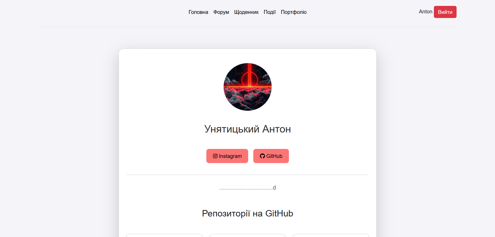
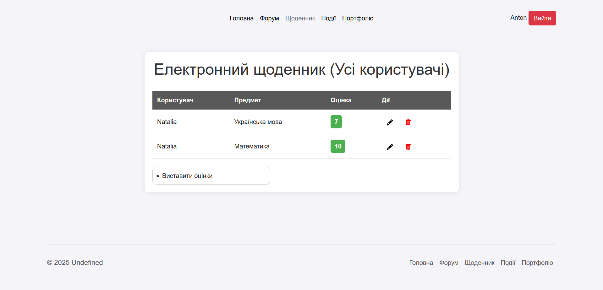
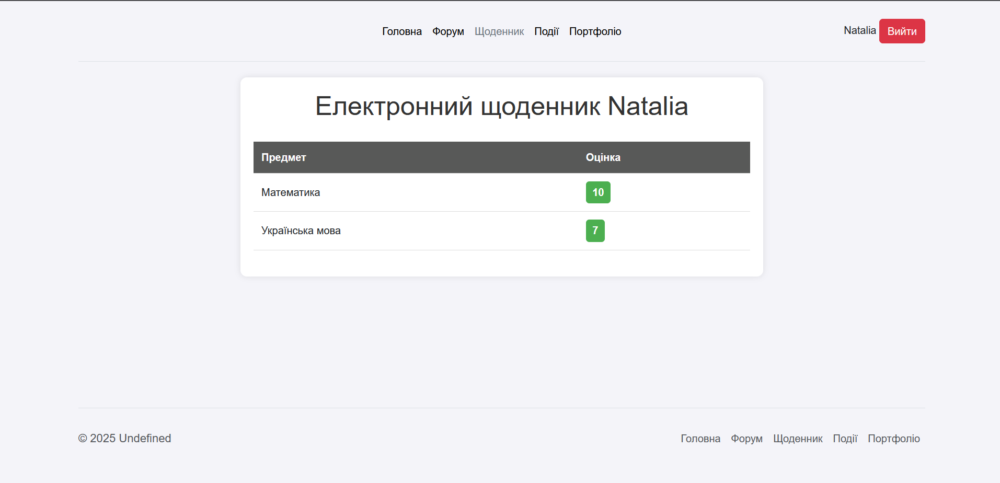
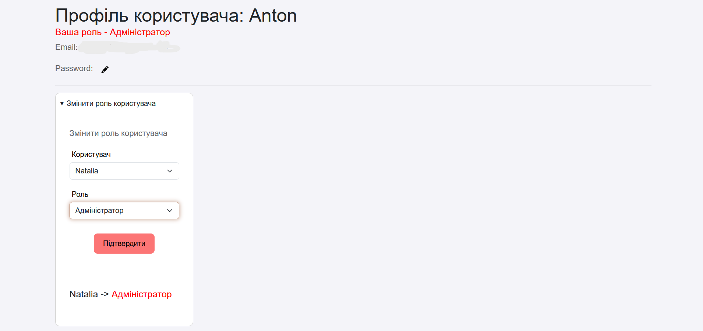

# Logika_portal

Шкільний портал з новинами, цікавими опитуваннями, системою ролей та багато чого іншого


## 😊 Можливості:

> 1. Створення портфоліо:
>   
> 2. Виставлення оцінок учням:
>       - Адмін:
>       
>       - Користувач:
>       
> 3. Зміна ролі користувача:
>       
> 4. Форум:
>       ❓Coming soon❓               
> 5. Календар подій:
>       ❓Coming soon❓
> 6. Голосування та опитування:
>       ❓Coming soon❓
> 7. Галерея:
>       ❓Coming soon❓
> 8. Матеріали:
>       ❓Coming soon❓
> 9. Оголошення:
>       ❓Coming soon❓        

### ✔️ Встановлення та залежності:
```powershell
git clone https://github.com/AntonUniatitskyi/Logika_portal
cd Logika_portal
pip install -r requirements.txt
```

#### 🌐 Для запуску сервера виконайте команду:

```powershell
python manage.py runserver
```